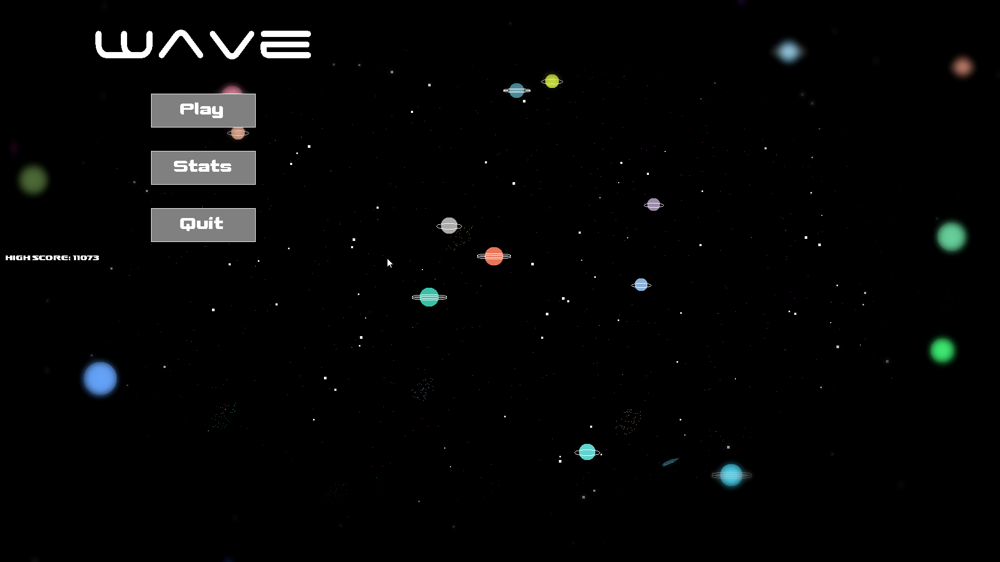

# WAVE
Bullet hell-type game that I made after just having learned the basics of Java programming (and programming in general) in 2017. It is rudimentary and has many bugs to be discovered by the player (exciting!). After I worked on it for a while I became pretty overwhelmed by how large the project was becoming, I was a novice programmer after all, and then just abandoned it. All the basics are in place, the next step would have been level design. There are some interesting concepts in the game though, such as the randomized space-background generator that I based on a programming assignment at university. The game is guaranteed to run with Java SDK 1.8.0_144 in any somewhat recent version of IntelliJ.

